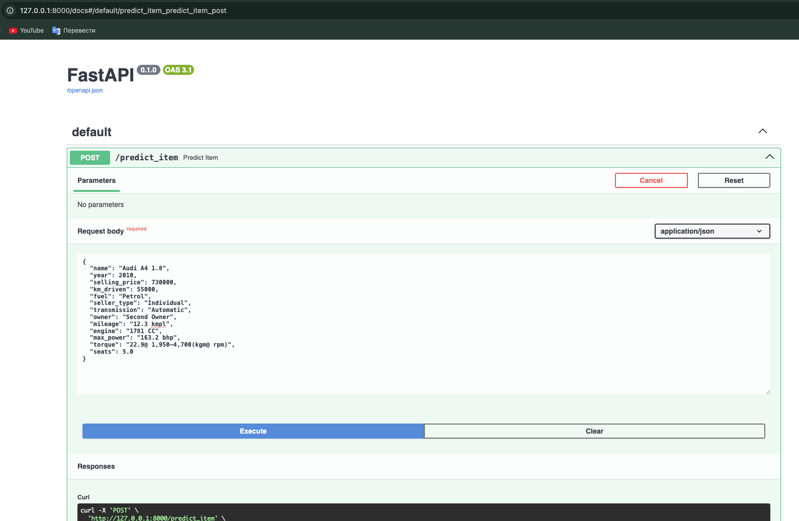
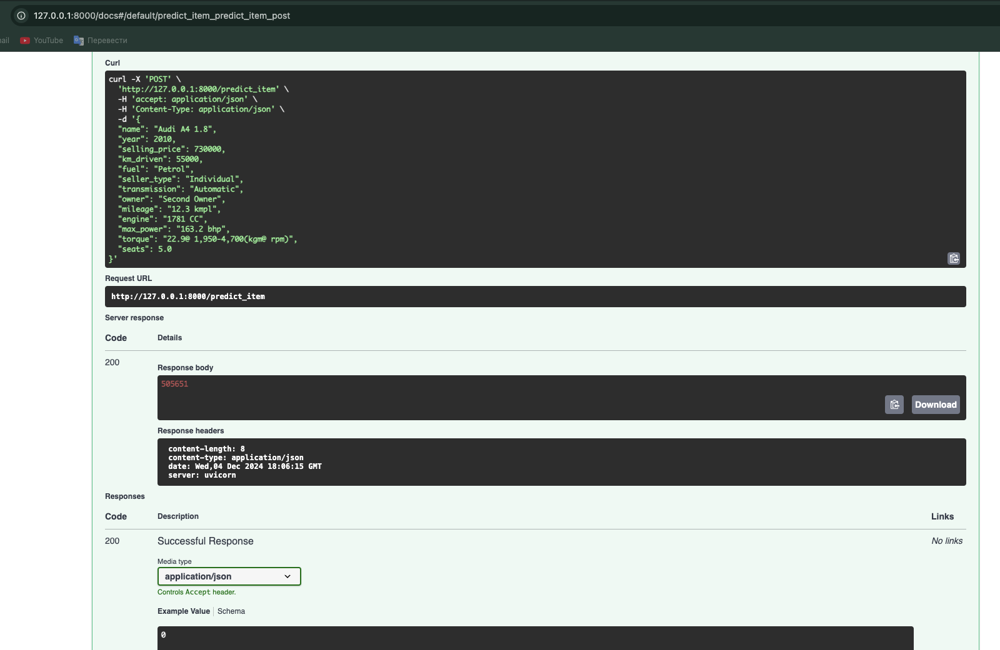
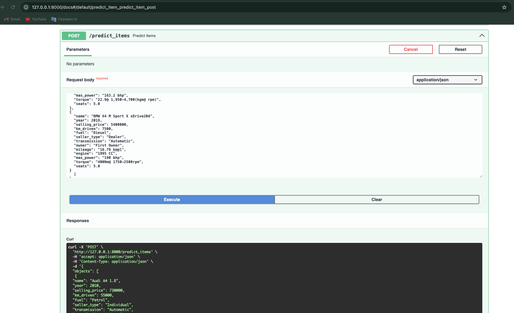
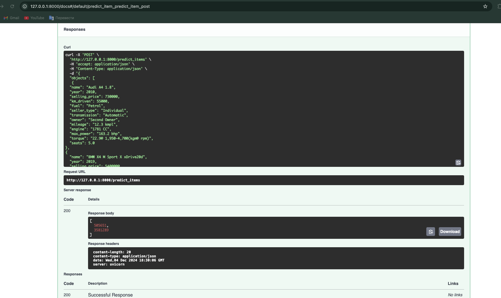

## Сделано

- Выполнена обработка признаков датасетов, их очистка, заполнения пропусков медианнами, удаление признаков, заполнение
  пропусков, удаление дубликатов, кодирование категориальных признаков
- Проведен анализ тренировочной и тестовой выборки: построение дашбордов с помощью ydata-profilling, меры изменчивости и
  отоншения каждого признака, построены тепловые карты по вычесленным значениям корреляций разыми способами
- Построена модель линейной регрессии на вещественных признаках с применением линейной регрессии с разной номрамлизацией
  и скалирования, расччитаны метрики R2 и MSE для каждой модели
- Обучены четыре регрессионные модели: линейная регрессия, Lasso-регрессия, ElasticNet-регрессия и Ridge-регрессия.
- Построен пайплайн для предобработки данных и предсказания цен с использованием лучшей модели
- Проделан рассчёт метрики business_metric
- Реализован сервис для предсказания цен с помощью FastAPI

## Результаты по качеству

- R2 = 0.59 показывает качество выше среднего
- Улучшение качества наблюдается после внедрения и кодирования категориальных признаков с использованием
  метода One Hot Encoding, а также преобразования столбца name в три разные категории с последующим кодированием методом
  Leave One Out Encoding. Дополнительно было применено MinMax-нормализация для всех признаков и оптимизирован параметр
  alpha.

## Что можно улучшить

- Анализ данных на наличие выбросов и их удаление в случае обнаружения.
- Исследование целевой переменной с выполнением необходимых преобразований, если это необходимо.
- Понимание причин, по которым результаты пайплайна могут отличаться от выводов в ноутбуке.

## Что дало наибольший буст в качестве

Наибольший прирост качества был получен за счет внедрения категориальных признаков с помощью One Hot-кодирования.
Исследование производилось до обработки столбца name, при этом соответствующий код не был включён в ноутбук.
Логарифмирование целевой переменной также продемонстрировало значительное положительное влияние на итоговые результаты.
Более того, высокая корреляция ряда категориальных признаков с целевой переменной подчеркивает их важность.
Предобработанные данные в столбце name и применение целевой кодировки (Target Encoding) с регуляризацией внесли меньший,
но все же ощутимый вклад в улучшение качества модели.

